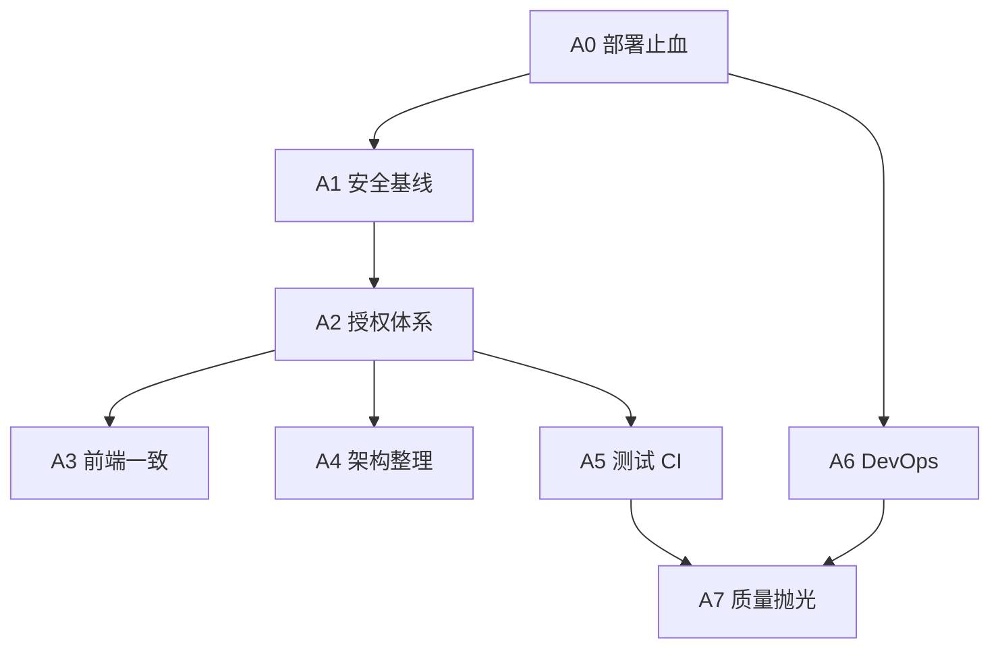

# 招聘管理系统 — 审计改进计划

> 基于 2026-06-10 代码审计与修改建议整理。  
> 目标：修复 Critical/High 问题，恢复部署可复现性，建立 CI 门禁，使系统达到可内网生产试运行的安全基线。  
> **不包含** Phase 1–5 功能增强（见 `.claude/plans/recruiting-system-improvement-plan.md`）。

---

## 1. 背景与现状

### 1.1 审计结论摘要

| 维度 | 现状 | 目标 |
|------|------|------|
| 功能完整度 | 高（ATS 全链路 + 移动端 + 飞书） | 维持 |
| 安全 / 授权 | 不合格（IDOR、公开上传、飞书绑定漏洞） | 资源级授权 + 鉴权下载 |
| 工程规范 | 部分合格（核心模块三层清晰，auth/users 漂移） | 统一分层 + 迁移入库 |
| 部署就绪 | 不合格（Nginx/Docker/Redis/迁移） | 一键 prod compose 可用 |
| 测试 | 27% 路由有集成测试，E2E 部分失效 | 核心路径 ≥80% 覆盖 + CI 门禁 |

### 1.2 改进原则

1. **安全优先**：P0 完成前不对外网/多部门开放。
2. **后端 enforce 为准**：前端 `requireAdmin` 仅 UX，权限以 API 中间件 + service 校验为唯一真相。
3. **最小可行 diff**：每 Phase 可独立合并、可验证、可回滚。
4. **测试随行**：每个 Phase 结束必须有过关的 lint + 相关测试 + 手工验收清单。

### 1.3 成功标准（全局 Done 定义）

- [ ] 所有 Critical 审计项已关闭并有验证记录
- [ ] member 用户无法通过 ID 枚举访问他人候选人/Offer/HC/邮件/解析任务
- [ ] 简历文件无法通过 `/uploads/{uuid}` 匿名访问
- [ ] `docker compose -f docker-compose.prod.yml up` 后 `/api/health` 经 Nginx 返回 200
- [ ] 空库 `prisma migrate deploy` + seed 可启动全栈
- [ ] GitHub Actions（或等效 CI）在 PR 上跑 lint + server test + client type-check
- [ ] E2E 12+ spec 全部 green（含 `/interviews`）

---

## 2. Phase 总览

| Phase | 名称 | 优先级 | 预估工期 | 依赖 |
|-------|------|--------|----------|------|
| **A0** | 紧急止血（部署 & 数据） | P0 | 1–2 天 | — |
| **A1** | 安全基线（上传 & 飞书 & JWT） | P0 | 2–3 天 | A0 |
| **A2** | 授权体系（IDOR 全面修复） | P0 | 3–5 天 | A1 |
| **A3** | 前端一致性 & 路由修复 | P1 | 1–2 天 | A2 部分并行 |
| **A4** | 架构整理 & 数据模型 | P1 | 3–4 天 | A2 |
| **A5** | 测试 & CI/CD | P1 | 3–4 天 | A2 |
| **A6** | DevOps 生产化 | P1 | 2–3 天 | A0 |
| **A7** | 质量抛光（Medium/Low） | P2 | 持续 | A5 |



---

## Phase A0：紧急止血（部署 & 数据）

**目标**：修复「系统无法按文档部署」和「敏感数据泄露」类阻断问题。

### 步骤概览

| 步骤 | 文件 / 范围 | 内容 |
|------|-------------|------|
| A0.1 | `.gitignore` | 增加 `backup/`、`*.dump`；**移除**对 `prisma/migrations/` 的全局忽略 |
| A0.2 | `backup/` | 移出仓库工作区；若曾 commit 则 history 清理 + 轮换密钥 |
| A0.3 | `nginx/nginx.conf` | `proxy_pass http://backend/api/;` 保留 `/api` 前缀 |
| A0.4 | `docker-compose.yml` | 统一 Postgres 与 `DATABASE_URL` 默认凭据；注入 `REDIS_URL` |
| A0.5 | `docker-compose.yml` / `prod` | 新增 `redis:7-alpine` 服务；server `depends_on: redis` |
| A0.6 | `docker-compose.prod.yml` | 同步 A0.4–A0.5；Postgres 不 publish 5432 到 `0.0.0.0` |
| A0.7 | `server/prisma/` | 对当前 schema 执行 `pnpm db:migrate --name init` 并提交 migrations |
| A0.8 | `.env.example` | 补全 `DATABASE_URL`、`REDIS_URL`、`CORS_ORIGIN`、`FEISHU_*`；删除弱 JWT 示例文案 |

### 验收

- [x] A0.1 `.gitignore`：backup/、*.dump；migrations 可入库
- [x] A0.3 Nginx `proxy_pass` 保留 `/api` 前缀（变量 + resolver 避免 upstream 解析失败）
- [x] A0.4–A0.6 Docker dev/prod：DB 凭据统一、Redis 服务、prod 不暴露 5432、Postgres `127.0.0.1:5432`
- [x] A0.7 保留既有 14 条 migration 入库；已删除重复的 `20250610000000_init`
- [x] A0.8 `.env.example` 已补全
- [x] 全栈验收：`curl http://localhost/api/health` → `success: true`

```bash
# 1. Nginx API 可达
curl -s http://localhost/api/health | jq .success   # true

# 2. 迁移可复现
docker compose exec server npx prisma migrate deploy  # 无 error

# 3. Redis 连通
docker compose exec server node -e "import('ioredis').then(...)"  # PONG
```

---

## Phase A1：安全基线（上传 & 飞书 & JWT）

**目标**：关闭 Critical 级主动攻击面（公开文件、伪造飞书绑定、JWT 信任链）。

### 步骤概览

| 步骤 | 文件 | 内容 |
|------|------|------|
| A1.1 | `server/src/app.ts` | 移除 `express.static('/uploads')` |
| A1.2 | `nginx/nginx.conf` | 移除 `/uploads/` 公开 alias |
| A1.3 | `server/src/routes/files.ts`（新建） | `GET /api/files/:id` 鉴权下载；校验用户与 candidate/job 关联 |
| A1.4 | `server/prisma/schema.prisma` | 可选：`UploadRecord`（filename, uploadedBy, entityType, entityId） |
| A1.5 | `client/` + `mobile/` | 简历链接改为 `/api/files/...` 或带 token 的 URL |
| A1.6 | `server/src/routes/auth.ts` | `/bind-feishu` 改为只收 `code`，服务端调飞书 API 取 employee_id |
| A1.7 | `server/src/routes/auth.ts` | 删除 404 响应中的 `feishuEmployeeId` 字段 |
| A1.8 | `server/src/middleware/rate-limit.ts`（新建） | `feishuLimiter`、`bindFeishuLimiter` |
| A1.9 | `server/src/middleware/auth.ts` | JWT verify 后查库校验 user 存在；catch 顺序先 `TokenExpiredError` |
| A1.10 | `server/src/lib/llm.ts` | 移除/降级 PII 日志；生产仅 log jobId + duration |
| A1.11 | `server/src/routes/upload.ts` | magic bytes 检测（`file-type`）；存储名 `{uuid}.ext` 白名单 |
| A1.12 | `server/src/routes/upload.ts` | DELETE 校验 `UploadRecord.uploadedBy === req.user.userId` |

### 验收

- [ ] 未登录访问旧 `/uploads/xxx.pdf` 返回 404/403
- [ ] 登录 user A 无法下载 user B 的 resume
- [ ] curl 伪造 `feishuEmployeeId` 绑定失败
- [ ] 降权用户旧 JWT 在下次请求返回 401

---

## Phase A2：授权体系（IDOR 全面修复）

**目标**：建立统一资源访问控制，修复所有 High 级 IDOR 与 admin 路由缺口。

### 2.1 基础设施

| 步骤 | 文件 | 内容 |
|------|------|------|
| A2.1 | `server/src/utils/access-control.ts`（新建） | `assertCandidateAccess`、`assertJobAccess`、`assertHCAccess` |
| A2.2 | `server/src/middleware/auth.ts` | `getUserDepartment`：member 且 department 为空 → 403 |
| A2.3 | `server/src/routes/users.ts` + service | 创建/更新 member 时 department 必填（Zod + DB） |
| A2.4 | `server/prisma/seed.ts` | member 用户均带 department |

### 2.2 Service 层接入

| 步骤 | Service | 接入点 |
|------|---------|--------|
| A2.5 | `candidate.service.ts` | getById / update / delete / advanceStage / list filter |
| A2.6 | `offer.service.ts` | 全部 CRUD + list 部门过滤 |
| A2.7 | `hc-request.service.ts` | getById：requester 或 admin |
| A2.8 | `job.service.ts` | duplicateJob 复用 getJobById 权限 |
| A2.9 | `communication.service.ts` | update/delete：createdById；followUp 默认 mine |
| A2.10 | `candidate.controller.ts` | getParseResumeStatus：校验 submittedBy |

### 2.3 路由 admin 补齐

| 步骤 | 路由文件 | 变更 |
|------|----------|------|
| A2.11 | `dictionaries.ts` | POST/PATCH/DELETE 加 `authorize('admin')` |
| A2.12 | `automation-rule.ts` | 全部写操作 + 删除 加 `authorize('admin')` |
| A2.13 | `email.ts` | 模板 CRUD 加 admin；send 限制 to 范围；logs 按角色过滤 |
| A2.14 | `tags.ts` | POST/PATCH/DELETE 加 `authorize('admin')` |
| A2.15 | `stats.ts` | 决策：admin-only **或** stats.service 部门过滤（二选一，文档化） |

### 2.4 输入校验

| 步骤 | 文件 | 内容 |
|------|------|------|
| A2.16 | `routes/candidates.ts` | POST `/` 增加 `createCandidateSchema` + `validate()` |
| A2.17 | `routes/auth.ts` | `/bind-feishu` 改用 Zod schema |

### 验收（集成测试必写）

| 用例 | 期望 |
|------|------|
| member A 读 member B 的 candidate/:id | 403 |
| member 无 department 访问 /candidates | 403 |
| member 调 POST /dictionaries | 403 |
| member 读他人 parse-resume job | 403 |
| admin 上述操作 | 200 |

---

## Phase A3：前端一致性 & 路由修复

**目标**：消除双 Store、修复断链路由、对齐后端权限 UX。

### 步骤概览

| 步骤 | 文件 | 内容 |
|------|------|------|
| A3.1 | `client/src/stores/user.ts` | 删除或标记 deprecated |
| A3.2 | `client/src/api/request.ts` | 删除（ orphan axios ） |
| A3.3 | `client/src/App.vue` | 改用 `useAuthStore().fetchUserInfo()` |
| A3.4 | `client/src/router/index.ts` | 注册 `/interviews` 路由 |
| A3.5 | `client/src/router/index.ts` | 移除 jobs/candidates/offers/hc 详情页的 `meta.public: true`（仅保留 login） |
| A3.6 | `client/src/utils/request.ts` | 401 豁免 `/auth/login` |
| A3.7 | `client/src/layouts/DefaultLayout.vue` | admin 菜单补「邮件模板」入口 |
| A3.8 | `client/src/views/settings/EmailTemplates.vue` | 预览前 DOMPurify；配合后端 sanitize |
| A3.9 | `mobile/src/lib/request.ts` | 401 / 错误处理与 client 对齐 |
| A3.10 | `mobile/src/views/jobs/JobDetail.vue` | 分享链接使用 `import.meta.env.BASE_URL`（含 `/m/`） |
| A3.11 | `mobile/.env.*` | App ID 移出 git；仅 `.env.example` 占位 |
| A3.12 | `mobile/src/lib/feishu.ts` | 生产关闭 debug log；`DEBUG_FEISHU` env 门控 |

### 验收

- [ ] 刷新后 client 登录态正常，无 `token` / `ats_token` 混用
- [ ] 未登录访问 `/candidates` 跳转 login
- [ ] CandidateDetail → 面试安排 → `/interviews` 正常
- [ ] member 账号 UI 看不到 admin 菜单项

---

## Phase A4：架构整理 & 数据模型

**目标**：核心模块外分层归位；schema 外键与审计日志落地。

### 步骤概览

| 步骤 | 文件 | 内容 |
|------|------|------|
| A4.1 | `services/auth.service.ts` + `controllers/auth.controller.ts` | 从 `routes/auth.ts` 迁出业务逻辑 |
| A4.2 | `services/user.service.ts` + `controllers/user.controller.ts` | 从 `routes/users.ts` 迁出 |
| A4.3 | `services/upload.service.ts` + controller | 从 `routes/upload.ts` 迁出 |
| A4.4 | `routes/stats.ts` | CSV 导出改调 `statsController`；删除重复 `convertToCSV` |
| A4.5 | `utils/csv.ts`（新建） | 统一 CSV 工具 |
| A4.6 | `schema.prisma` | Job ↔ HCRequest 双向 `@relation`；OnboardingTask.assigneeId → User |
| A4.7 | `schema.prisma` | EmailTemplate/EmailLog.createdById → User FK |
| A4.8 | `services/operation-log.service.ts`（新建） | 在 candidate/job/offer/stage 变更处写入 OperationLog |
| A4.9 | `middleware/auth.ts` | 401/403 改 `next(AppError)` 统一 errorHandler |
| A4.10 | `index.ts` | shutdown：`worker.close()` + `queue.close()` + `redis.quit()` |
| A4.11 | `workers/resume-parser.worker.ts` | failed/finally 清理 temp；queue 配置 retry/backoff |
| A4.12 | `services/email-template.service.ts` | 写入时 `sanitizeHtml(body)` |
| A4.13 | `package.json` (server) | prisma / @prisma/client 统一 5.22.0 |
| A4.14 | 死代码清理 | `utils/index.ts` 未用导出、`createError`、`getHCStats`（接入或删除） |

### 验收

- [ ] `routes/auth.ts` < 80 行（仅 wiring）
- [ ] stats 导出单一路径，无 routes 内联 CSV
- [ ] migration 含 FK 变更且 deploy 成功
- [ ] 创建候选人后 operation_log 有记录

---

## Phase A5：测试 & CI/CD

**目标**：测试覆盖核心安全路径；PR 合并有自动化门禁。

### 5.1 服务端测试（优先级序）

| 步骤 | 文件 | 内容 |
|------|------|------|
| A5.1 | `tests/integration/auth.test.ts` | login / feishu / bind / 401 |
| A5.2 | `tests/integration/access-control.test.ts` | IDOR 矩阵（candidate/offer/hc/parse） |
| A5.3 | `tests/integration/dictionaries.test.ts` | member 403 / admin 200 |
| A5.4 | `tests/integration/email.test.ts` | admin-only + send 限制 |
| A5.5 | `tests/integration/hc-requests.test.ts` | 审批流 + 详情 IDOR |
| A5.6 | `tests/integration/files.test.ts` | 鉴权下载 |
| A5.7 | `tests/unit/*.test.ts` | 补：hc-request, mail, notification, communication |
| A5.8 | `tests/integration/interviews.test.ts` | CRUD + 通知 |

### 5.2 前端测试

| 步骤 | 文件 | 内容 |
|------|------|------|
| A5.9 | `client/tests/router.test.ts` | public 路由 / requireAdmin |
| A5.10 | `client/tests/request.test.ts` | 401 行为 |
| A5.11 | `mobile/src/tests/feishu.test.ts` | mock SDK，测 isFeishu / getAuthCode |

### 5.3 E2E 修复

| 步骤 | 文件 | 内容 |
|------|------|------|
| A5.12 | `e2e/tests/helpers.ts` | 真实 UI/API 登录，移除硬编码 JWT |
| A5.13 | `e2e/tests/interviews.spec.ts` | 依赖 A3.4 路由 |
| A5.14 | `e2e/tests/auth.spec.ts` | 修正 `.sidebar` 选择器；真实 logout UI |
| A5.15 | `e2e/tests/permissions.spec.ts`（新建） | member 访问 admin 页/API 期望 403 |
| A5.16 | `e2e/tests/settings.spec.ts` | dictionary/tag CRUD 提交 |

### 5.4 CI

| 步骤 | 文件 | 内容 |
|------|------|------|
| A5.17 | `.github/workflows/ci.yml`（新建） | pnpm install → lint → server test → client type-check |
| A5.18 | `.github/workflows/e2e.yml`（新建，optional） | nightly Playwright |
| A5.19 | `pnpm-workspace.yaml` | 加入 `e2e` package |

### 验收

- [ ] server tests coverage：services lines ≥80%, branches ≥75%
- [ ] PR 上 CI green
- [ ] `cd e2e && pnpm test` 全部通过

---

## Phase A6：DevOps 生产化

**目标**：deploy 脚本、Docker、文档与 prod compose 一致。

### 步骤概览

| 步骤 | 文件 | 内容 |
|------|------|------|
| A6.1 | `deploy.sh` / `deploy.ps1` | 改用 `docker-compose.prod.yml`；迁移失败不 `\|\| true` |
| A6.2 | `Makefile` | 修正 install 路径；`deploy` 指向 prod compose |
| A6.3 | `server/Dockerfile` / `client/Dockerfile` | corepack + pnpm + frozen lockfile |
| A6.4 | `docker-compose.prod.yml` | 增加 mobile-build profile 或文档说明预构建 |
| A6.5 | `nginx/nginx.conf` | TLS 块（注释模板）；安全头；`/health` proxy 到 backend |
| A6.6 | `DEPLOY.md` / `AGENTS.md` | 与 A6.1 实际行为对齐 |
| A6.7 | `package.json` (root) | `@playwright/test` → devDependencies |
| A6.8 | `server/src/index.ts` | 启动时 `await connectRedis()`，失败 exit 1 |

### 验收

- [ ] 全新 VM：`deploy.ps1` 后浏览器可登录
- [ ] 迁移失败时脚本 exit non-zero
- [ ] prod compose Postgres 不对公网暴露

---

## Phase A7：质量抛光（P2，持续迭代）

按优先级批次处理 Medium/Low 项，不阻塞 A0–A6 上线。

### 批次 7a — API & UX 一致（~2 天）

- 统一 API 响应：`auth` login token 放入 `data`；users 分页改 `pageSize`
- 密码策略：min 8 + 复杂度 Zod
- client/mobile：关键按钮 `aria-label`；`mobile/index.html` lang=`zh-CN`
- 移除生产环境 HTTP 请求 console.log

### 批次 7b — 依赖 & 安全加固（~1 天）

- 评估 `xlsx` 升级或替代
- Feishu SDK：自托管或 SRI
- Swagger：dev-only + basic auth
- `multer` 评估升级至 2.x

### 批次 7c — 可观测性（~2 天）

- 结构化日志（pino）替代 console
- 邮件发送失败告警 / EmailLog 必写
- health check 含 DB + Redis 状态

### 批次 7d — 文档 & 枚举（~2 天）

- Prisma enum 替代关键 String 字段（role, job.status, stage）
- API 文档区分 Interview（安排）vs InterviewFeedback（反馈）
- 备份策略文档（加密、保留期、禁止入库）

---

## 3. 里程碑与排期建议

| 里程碑 | 包含 Phase | 目标日期（示例） | 交付物 |
|--------|-----------|------------------|--------|
| M1 可部署 | A0 + A6 部分 | +1 周 | Nginx/Docker/迁移/Redis 可用 |
| M2 安全基线 | A0 + A1 + A2 | +2–3 周 | IDOR 关闭、上传鉴权、飞书修复 |
| M3 可合并主干 | + A3 + A5 CI | +4 周 | 前端一致、CI green、核心集成测试 |
| M4 架构债 | A4 | +5 周 | auth/users 分层、FK、操作日志 |
| M5 生产试运行 | A6 完成 + A7a | +6 周 | 内网 pilot |

> 1 人全职约 6 周；2 人可 A2/A3/A5 并行，压缩至约 4 周。

---

## 4. 风险与依赖

| 风险 | 影响 | 缓解 |
|------|------|------|
| 部门过滤与 JSON `departments` 查询性能 | 列表变慢 | 加 GIN 索引或冗余 department 字段 |
| 上传改鉴权 URL 破坏旧链接 | 历史简历打不开 | 迁移脚本批量写 UploadRecord；短期兼容 redirect |
| 飞书 bind 流程变更 | 移动端需发版 | 与 FE 联调；保留旧接口 deprecated 一周 |
| migration 与现有 prod 库不一致 | deploy 失败 | 先在 staging 快照恢复验证 |
| member 无 department 历史数据 | 403 大面积 | A2 前跑数据修复脚本 |

---

## 5. 每 Phase 合并检查清单（PR Template）

```markdown
## 改进 Phase: A_ _

### 变更摘要
-

### 测试
- [ ] pnpm lint
- [ ] cd server && pnpm test
- [ ] cd client && pnpm type-check
- [ ] 手工验收（见 improvement-plan Phase 对应节）

### 安全回归
- [ ] 未新增公开路由
- [ ] 写操作有 authenticate + 必要 authorize
- [ ] 无 PII console.log

### 迁移
- [ ] prisma migrate 已提交（如有 schema 变更）
- [ ] .env.example 已更新
```

---

## 6. 审计项 → Phase 映射（速查）

| 审计 ID | 主题 | Phase |
|---------|------|-------|
| C-01 | 上传公开访问 | A1 |
| C-02 | 飞书绑定 | A1 |
| C-03, C-04 | 候选人/解析 IDOR | A2 |
| C-05 | 迁移缺失 | A0 |
| C-06 | Nginx API | A0 |
| C-07, C-08 | Docker DB/Redis | A0, A6 |
| C-09, C-10, C-11 | 前端 Store/路由/E2E | A3, A5 |
| C-12 | backup PII | A0 |
| H-04~H-14 | admin 路由 / IDOR / 日志 | A2, A1 |
| H-16~H-19 | 架构 / FK / OperationLog | A4 |
| H-20~H-21 | 测试缺口 | A5 |
| H-35~H-40 | CI/CD / deploy | A5, A6 |
| Medium/Low | 见 A7 批次 | A7 |

---

## 7. 不在本计划范围

以下事项记录在功能增强计划中，**本审计改进计划不展开**：

- 新功能（Offer 审批流、飞书日历、人才池等）
- UI/UX 大改版
- 性能优化（除部门过滤索引外）
- 多租户 / SaaS 化

---

*文档版本：1.0 | 生成日期：2026-06-10 | 维护：随 Phase 完成更新验收 checkbox*
